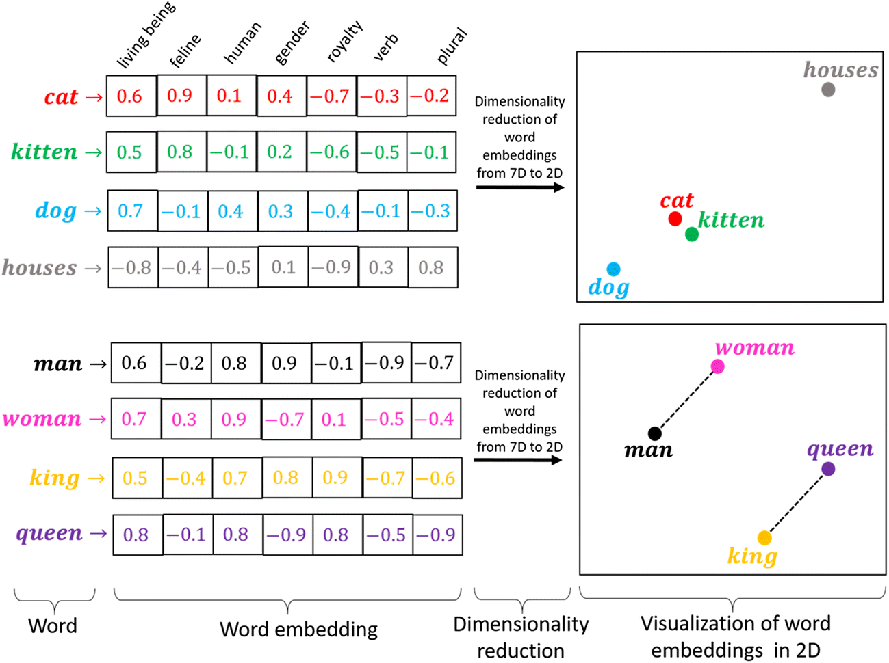
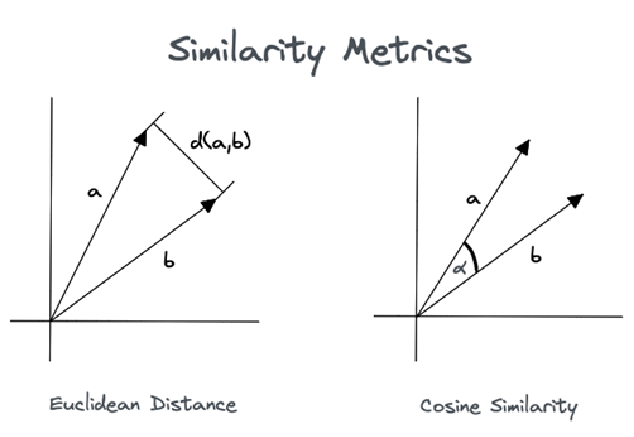

# Chapter 1 - VectorDB 개요

### AI의 떠오르는 별
---
#### 벡터DB가 각광받는 이유
벡터디비는 자연어 처리 ( 이하 NLP, 지피티 & 제미나이 등등 ) 분야에서 크게 기여하며 유명해졌다.  
이름만으로는 기존 데이터베이스에 벡터만 추가되어 비슷한 느낌이 드는데,  
NLP에게는 <b>조금 다르게</b> 접근해야 할 것 같다. 
 
세상의 많고많은 데이터들 중 AI가 쓰기 좋게 정리된 데이터 ( 이하 <b>정형데이터</b> )는 20%, 정리가 필요한 데이터 ( 이하 <b>비정형데이터</b> )는 80%가 존재한다.  
정형데이터는 RDBMS와 같은 관계형 DB에 자주 사용하고, 간혹 NoSQL에도 바로 사용할 수 있는 넓은 스펙트럼을 가진 반면,  
비정형데이터는 정해진 컬럼 자체가 없는 구조이기 때문에 관계를 중요시하는 RDBMS에는 매우 부적합한 데이터이다.  
<b>오직 저장</b>을 위해서라면 NoSQL을 사용하지만, AI에게 문장을 이해시키기에는 한없이 부족하다.  
 
AI가 문장을 이해하는 데에는 <b>벡터DB가 무조건 필요하다</b>고 할 수 있는데, 이유는 뭘까?  
 
LLM · NLP같은 AI모델은 <b>유사도 기반 검색</b>을 자주 사용하는데, 
 이 과정에서 벡터화된 데이터가 저장된 <b>"벡터 공간"</b>이 필요하다. 

그럼 어떻게 벡터화된 데이터가 만들어질까?

### Vector에 대한 이해
---
#### Embedding ( 임베딩 ) 이란?
AI 모델을 큰 함수라고 생각해보자 << 실제로 함수 맞음  
숫자 형태의 입력이 들어오면 숫자로 출력을 보낼 수 있지만, 사람의 언어는 숫자형태가 아니기에  
모델이 이해할 수 있는 숫자형태로 변환해주어야 한다.  
 

> *책속 이미지가 아닙니다. 이해용 자료*
 
 
이미지와 같이 문장 당 <b>여러가지 개념들의 유사성을 판단하여 고차원 벡터를 만들어낸다. </b> 
벡터값을 2D로 표현하면 이미지 오른쪽의 plot이 나오는데,  
<b>상반된 의미를 가진 문장은 정반대로</b> ( king, queen 등), <b>의미가 비슷한 문장 ( cat, kitten )은 군집해있는 모습</b>을 볼 수 있다.  
 

#### 벡터값이란 ?
문장을 고차원 벡터로 변환하는 작업을 임베딩 ( Embedding )이라고 한다.  
벡터는 여러 형태의 비정형데이터를 컴퓨터가 이해하기 제일 쉬운 숫자 형태로 변환한 숫자값으로 이해하면 될 것 같다.  
 
벡터는 보통 [0.3, -0.7, ...] 이런식으로 표현되지만 <b>실제로는 숫자 자체로는 크게 의미가 없으며</b>, <b>숫자간의 거리 & 각도 등등의 값과 관계에 따라 데이터 유사도를 판단</b>한다.  

#### 벡터 관계
RDB에서 테이블 간의 관계를 표현할 때에는 외래키를 참조하여 표현하지만, 벡터디비는 관계를 나타내는 다른 방법이 여러 개 존재한다.  
 
가장 많이 사용되는 유사도 계산법은 <b>벡터 간 거리 or 각도</b>를 통해 계산된다.  
따라서 벡터간의 관계는 수십개, 혹은 <b>수천 개보다도 더 많이</b> 가지게 될 수도 있다. 
 
  
> *책속 이미지가 아닙니다. 이해용 자료*
 
거리 간 유사도 계산법을 있어보이게 말하려면 <b>'유클리디안 계산법'</b>이라고 하고, 각도 간 유사도 계산법은 <b>'코싸인 유사도 계산법'</b>
이라고 하면 된다.  

대표적인 두 기법으로 측정된 <b>유사도를 기반으로 수천수만 개 이상의 관계를 표현</b>한다.  

#### 벡터DB와 RDB / NoSQL DBMS
<b>RDBMS / NoSQL DBMS 대신 벡터DB 쓰는 이유</b> 
- 저장하는 데이터 형식이 다름  

    - 
    - RDB가 할수 없는 <b>'데이터 간 유사도'</b> 검색이 가능함